RETOS
==============

1. Explica qué partes conforman el UX y qué partes el UI
---------------------------------------------------------
La pagina que se utiliza es la de Laboratoria para este ejercicio.

Pagina principal de Laboratoria.
--------------------------------

Partes de UI.
=================

  Botones.

  - Estos botones te llevan a mas información acerca de Laboratoria el de "Estudiantes" da informacion acerca de lo que ofrecen a las mujeres para que deseen postularse. Mientras que el de "Epresas" es para gente que quiera contratar a las egresadas de Laboratoria

  - Este boton lleva otra pagina en el cual da mas detalles para que te postules para comenzar  tu proceso de admisión a laboratoria.

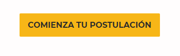

  - Los botones de las redes sociales.

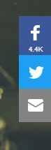

- Enlace a textos importantes.

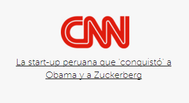

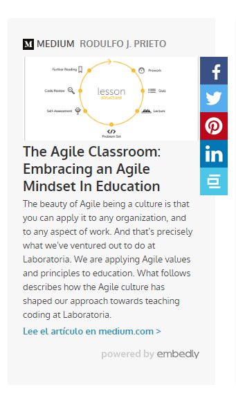

  - Enlace a un blog que da mas datos de Laboratoria.

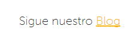

  - Por ultimo unos enlaces de contacto.

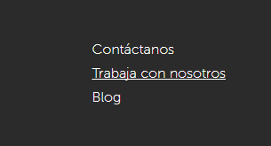

Parte de UX
=============

La parte de UX se puede representar con esta imagen ya que muestra la felicidad y satisfacción de una mujer que decidio postularse y termino su proceso en Laboratoria.

Pero en generar la parte de UX es lo facil que se entiende la pagina para entrar y estar navegando sin complicaciones.

-------------------------------

 2. Identifica los elementos de navegación en la pagina de GitHub.
======
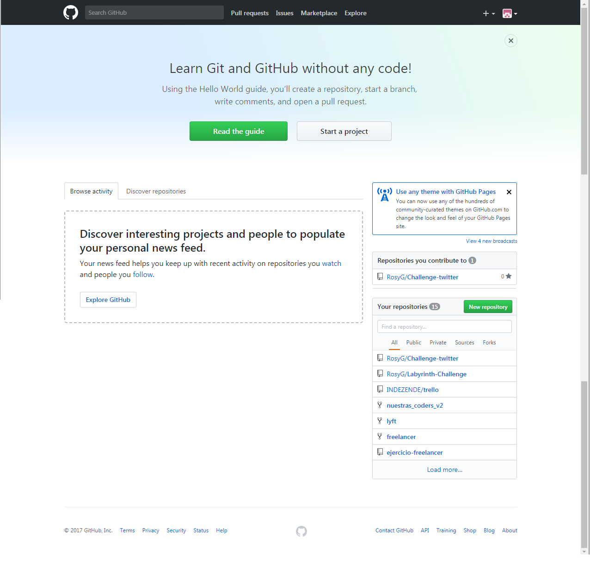

  - Navegación Global.
  --------------------
 Es la navegación principal del site. Normalmente es persistente y nos ayuda a explorar todas las opciones del site.

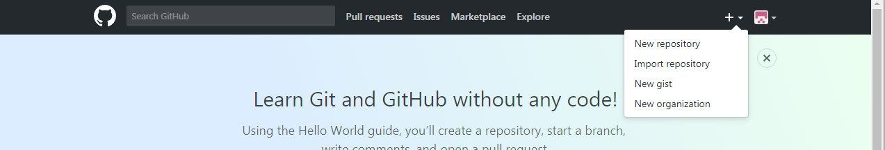

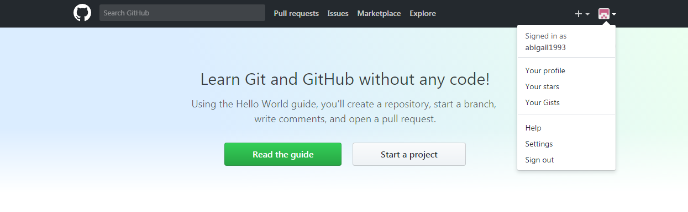

  - Facetada.
  ----------
 Es la navegación a través de filtros no editables, definidos previamente por el sistema.

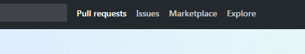

  - Contextual.
  -----------
  Se usa principalmente para recomendaciones.
  (el ejemplo es la informacion de los repositorios sug eridos.)

  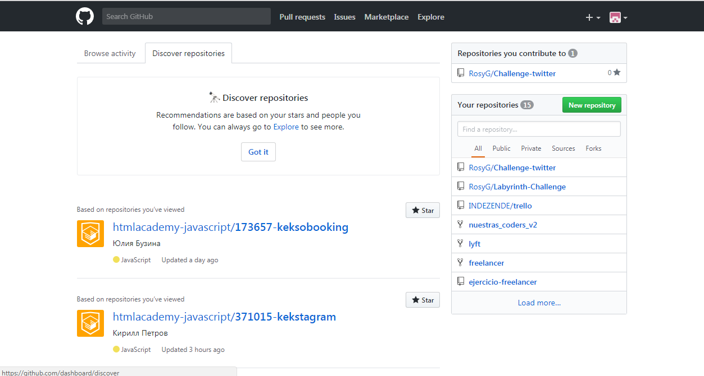

  - En linea.
---------------------
Son links de referencia utilizados principalmente en artículos. (en la imagen esta en letras azules.)

  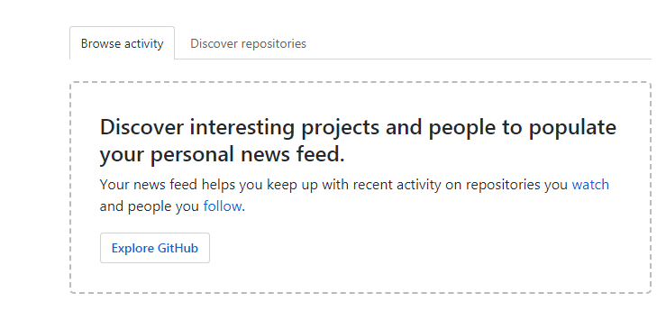

  - Suplementaria.
------------------------
Es la navegación adicional, utilizada para señalar algunas funciones a nuevos usuarios. (Ejemplo en los recuadros rojos.)

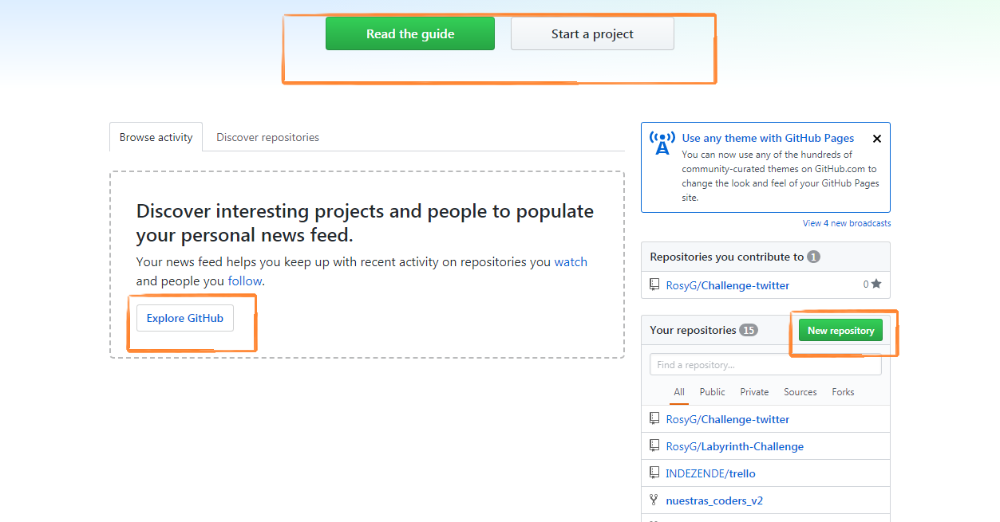

_____________________________________

 3.  Crea un sketch para la herramienta del dashboard de Laboratoria.
 ==============

 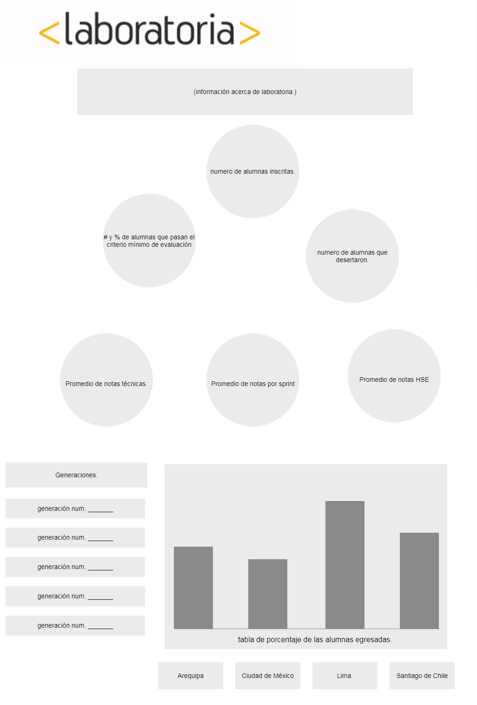
